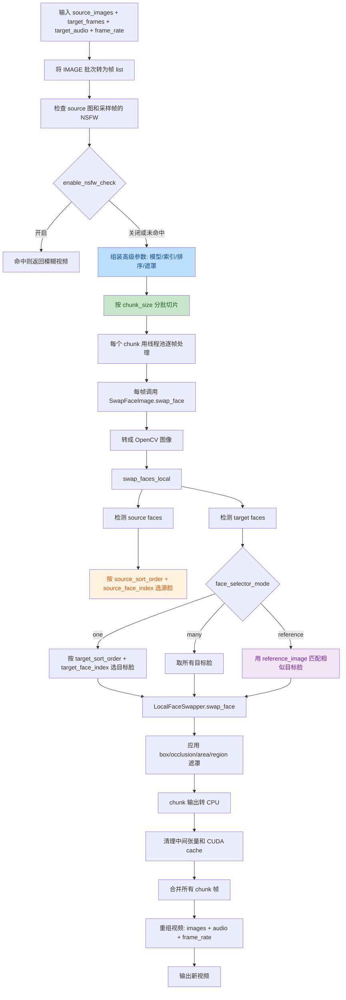

# Facefusion ComfyUI 中文说明

`Facefusion_comfyui` 是一个给 ComfyUI 使用的本地换脸节点包，支持图片换脸、视频换脸、目标脸检测、遮罩可视化，以及基于 ONNX 的本地推理。

当前版本已移除远程 API 模式，所有换脸节点都只走本地推理。

默认推荐配置：

- `face_swapper_model = hyperswap_1c_256`：综合效果较好
- `pixel_boost = 512x512`：速度和质量平衡
- `enable_nsfw_check = true`：默认开启内容检测，命中时返回模糊结果

## 节点总览
当前节点注册见 [__init__.py](file:///e:/E/Python/AI/nodes/Facefusion_comfyui/facefusion_api/__init__.py#L8-L38)。

| 节点显示名 | 类名 | 作用 |
|---|---|---|
| `FF: Swap Face (Image)` | `SwapFaceImage` | 基础图片换脸，参数少，适合快速上手 |
| `FF: Swap Face (Video)` | `SwapFaceVideo` | 基础视频换脸，参数少，适合直接处理视频 |
| `FF: Advanced Swap Face (Image)` | `AdvancedSwapFaceImage` | 高级图片换脸，支持脸选择、遮罩、排序、参考脸匹配 |
| `FF: Advanced Swap Face (Video)` | `AdvancedSwapFaceVideo` | 高级视频换脸，支持视频逐帧换脸和高级控制 |
| `FF: Face Detector` | `FaceDetectorNode` | 检测目标图中的脸，并输出 `FACE_DATA` |
| `FF: Face Swap Applier` | `FaceSwapApplier` | 将检测结果中的指定脸应用换脸 |
| `FF: Pixel Boost` | `PixelBoostNode` | 单独传递 `pixel_boost` 设置 |
| `FF: Visualize Faces` | `FaceDataVisualizer` | 可视化检测框和关键点 |
| `FF: Visualize Face Mask` | `FaceMaskVisualizer` | 可视化遮挡遮罩、解析遮罩或组合遮罩 |

## 1. 基础节点
### `FF: Swap Face (Image)`
代码入口见 [image_nodes.py](file:///e:/E/Python/AI/nodes/Facefusion_comfyui/facefusion_api/nodes/image_nodes.py#L6-L81)。

输入参数：

- `source_images`：源人脸图片，支持批量输入，但基础节点默认只取第一张作为源脸。
- `target_image`：目标图片。
- `face_swapper_model`：换脸模型。
- `face_detector_model`：人脸检测模型。
- `enable_nsfw_check`：是否启用 NSFW 内容检测，命中后返回模糊结果。

适用场景：

- 单人对单人快速换脸
- 不需要手动控制目标脸顺序、遮罩或参考脸匹配

### `FF: Swap Face (Video)`
代码入口见 [video_nodes.py](file:///e:/E/Python/AI/nodes/Facefusion_comfyui/facefusion_api/nodes/video_nodes.py#L7-L174)。

输入参数：

- `source_images`：源人脸图片，默认只取第一张。
- `target_frames`：目标视频帧序列，类型为 `IMAGE`，可先在外部工作流做插帧、抽帧、裁切、修复后再输入。
- `target_audio`：可选音频输入，类型为 `AUDIO`。
- `face_swapper_model`：换脸模型。
- `face_detector_model`：人脸检测模型。
- `max_workers`：并发帧处理线程数。
- `frame_rate`：输出视频帧率。
- `chunk_size`：每批处理多少帧，处理完一个 chunk 后再进入下一批。
- `processing_mode`：视频处理模式。
  - `memory`：分批处理后在内存中合并
  - `disk`：每个 chunk 先写临时 mp4，再合并后回读
- `enable_nsfw_check`：是否在视频进入换脸前做 NSFW 检测。

适用场景：

- 快速视频换脸
- 不需要复杂遮罩或参考脸筛选

## 2. 高级图片换脸节点
### `FF: Advanced Swap Face (Image)`
代码入口见 [image_nodes.py](file:///e:/E/Python/AI/nodes/Facefusion_comfyui/facefusion_api/nodes/image_nodes.py#L175-L493)。

这是日常最推荐使用的图片换脸节点。

#### 基础输入
- `source_images`：源人脸图片。
- `target_image`：目标图片。
- `face_swapper_model`：选择换脸模型。
- `face_detector_model`：选择检测器。
- `enable_nsfw_check`：是否启用 NSFW 内容检测。

#### 质量与遮罩
- `pixel_boost`：局部高分辨率换脸尺寸。
  - `256x256`：更快
  - `512x512`：推荐
  - `768x768` / `1024x1024`：更清晰，但更慢
- `face_occluder_model`：遮挡模型，常用于头发、手、遮挡物场景。
- `face_parser_model`：人脸语义解析模型。
- `face_mask_blur`：边缘融合强度，越大边缘越柔和。

#### 脸选择策略
- `face_selector_mode`
  - `one`：只处理一张目标脸
  - `many`：处理目标图中的所有脸
  - `reference`：按照参考脸相似度匹配目标脸
- `source_face_index`：源图中第几张脸作为换脸来源。
- `target_face_index`：目标图中第几张脸会被替换，仅 `one` 模式生效。
- `source_sort_order`：源图中的脸如何排序后再取索引。
- `target_sort_order`：目标图中的脸如何排序后再取索引。
- `score_threshold`：检测置信度阈值，越高越严格。

#### 遮罩开关
- `use_box_mask`：使用基础框遮罩，默认开启。
- `use_occlusion_mask`：使用遮挡遮罩。
- `use_area_mask`：使用区域遮罩。
- `use_region_mask`：使用语义区域遮罩。

#### 遮罩细化参数
- `face_mask_areas`：区域遮罩的区域列表，逗号分隔。
  - 可选：`upper-face`、`lower-face`、`mouth`
- `face_mask_regions`：语义解析区域列表，逗号分隔。
  - 常见：`skin`、`nose`、`mouth`、`upper-lip`、`lower-lip`、`left-eye`、`right-eye`
- `face_mask_padding`：框遮罩边距，格式为 `上,右,下,左`。

#### 可选输入
- `reference_image`：参考脸图片，仅 `reference` 模式使用。
- `reference_face_distance`：参考脸匹配阈值，值越小越严格。

#### 推荐用法
- 单人图：`one + target_face_index=0`
- 多人图精准替换：设置 `source_sort_order`、`target_sort_order` 后，再配合两个 index
- 保留嘴部或细节：`box + region`
- 脸边容易穿帮：`box + occlusion + region`

## 3. 高级视频换脸节点
### `FF: Advanced Swap Face (Video)`
代码入口见 [video_nodes.py](file:///e:/E/Python/AI/nodes/Facefusion_comfyui/facefusion_api/nodes/video_nodes.py#L179-L559)。

这是视频换脸的核心节点，实际视频帧处理链路在 [video_nodes.py](file:///e:/E/Python/AI/nodes/Facefusion_comfyui/facefusion_api/nodes/video_nodes.py#L510-L548)。

#### 基础输入
- `source_images`：源脸图片。
- `target_frames`：外部准备好的视频帧序列，类型为 `IMAGE`。
- `target_audio`：可选音频输入，类型为 `AUDIO`。
- `face_swapper_model`：换脸模型。
- `face_detector_model`：检测模型。
- `enable_nsfw_check`：是否在处理视频前检测源图和抽样帧。
- `frame_rate`：输出视频使用的帧率。

#### 画质与边缘融合
- `pixel_boost`：单帧局部高分辨率换脸尺寸。
- `face_occluder_model`：遮挡模型。
- `face_parser_model`：解析模型。
- `face_mask_blur`：融合边缘模糊度。

#### 源脸/目标脸控制
- `face_selector_mode`
  - `one`：固定替换一个目标脸
  - `many`：每帧所有检测到的脸都替换
  - `reference`：每帧只替换和参考脸相似的目标脸
- `source_face_index`：源图中用哪张脸。
- `target_face_index`：目标视频帧中替换哪张脸，仅 `one` 模式生效。
- `source_sort_order`：源图排序规则。
- `target_sort_order`：目标帧排序规则。
- `score_threshold`：检测阈值。

#### 遮罩参数
- `use_box_mask`
- `use_occlusion_mask`
- `use_area_mask`
- `use_region_mask`
- `face_mask_areas`
- `face_mask_regions`
- `face_mask_padding`

这些参数和高级图片节点一致，只是这里会应用到视频每一帧。

#### 性能参数
- `max_workers`：并发处理线程数。
  - 显存紧张时适当降低
  - CPU 模式建议不要开太高
- `chunk_size`：每批帧的处理数量。
  - 节点会先把 `IMAGE` 批次拆成 list，再按 `chunk_size` 分批处理
  - 每个 chunk 处理完会先转回 CPU 并清理 CUDA cache，减小长视频峰值显存
  - `chunk_size` 越小，显存更稳，但整体速度可能下降
- `processing_mode`：处理模式。
  - `memory`：默认模式，chunk 处理后直接在内存中拼接
  - `disk`：每个 chunk 先写入临时 mp4，再用 ffmpeg 进行合并；更适合长视频和小显存
  - 当前节点最终仍需返回 `VIDEO`，所以 `disk` 模式主要优化“处理阶段”峰值，不是彻底无内存回收的纯磁盘工作流

#### 可选输入
- `reference_image`：参考脸图片。
- `reference_face_distance`：参考脸距离阈值。

#### 适合的场景
- 指定一张源脸，替换视频里固定主角
- 多人视频中按位置、大小或左右顺序锁定目标脸
- 参考脸模式下，对视频内相似人物进行筛选替换

## 4. 检测与辅助节点
### `FF: Face Detector`
代码入口见 [detector_nodes.py](file:///e:/E/Python/AI/nodes/Facefusion_comfyui/facefusion_api/nodes/detector_nodes.py#L6-L165)。

用途：

- 检测图片中的脸
- 选择一张脸、多张脸，或者根据参考脸筛选
- 输出 `FACE_DATA` 供后续节点使用

参数说明：

- `image`：输入图片
- `face_detector_model`：检测器
- `face_selector_mode`：`one` / `many` / `reference`
- `face_position`：取第几张脸
- `sort_order`：排序规则
- `score_threshold`：检测阈值
- `reference_image`：参考脸图片
- `reference_face_distance`：参考脸距离阈值

### `FF: Face Swap Applier`
代码入口见 [utility_nodes.py](file:///e:/E/Python/AI/nodes/Facefusion_comfyui/facefusion_api/nodes/utility_nodes.py#L44-L230)。

用途：

- 对 `Face Detector` 输出的 `FACE_DATA` 中指定的脸应用换脸
- 适合“先检测，再人工看可视化，最后指定一张脸换”的工作流

参数说明：

- `source_images`：源脸图片
- `target_face_data`：检测结果
- `face_swapper_model`：换脸模型
- `pixel_boost`：增强尺寸
- `face_occluder_model`：遮挡模型
- `face_parser_model`：解析模型
- `face_mask_blur`：边缘融合强度
- `face_index`：`FACE_DATA` 里的第几张脸
- `enable_nsfw_check`：是否启用 NSFW 内容检测

### `FF: Pixel Boost`
代码入口见 [utility_nodes.py](file:///e:/E/Python/AI/nodes/Facefusion_comfyui/facefusion_api/nodes/utility_nodes.py#L7-L39)。

用途：

- 作为一个参数传递节点
- 自身不做换脸，只是把 `pixel_boost` 和图片一起传下去

参数说明：

- `image`：输入图片
- `pixel_boost`：增强尺寸

### `FF: Visualize Faces`
代码入口见 [visualizer_nodes.py](file:///e:/E/Python/AI/nodes/Facefusion_comfyui/facefusion_api/nodes/visualizer_nodes.py#L6-L86)。

用途：

- 可视化人脸检测框
- 可视化关键点
- 用来确认排序、索引、检测是否正确

参数说明：

- `face_data`：检测输出
- `draw_landmarks`：是否画关键点
- `draw_bbox`：是否画框

### `FF: Visualize Face Mask`
代码入口见 [visualizer_nodes.py](file:///e:/E/Python/AI/nodes/Facefusion_comfyui/facefusion_api/nodes/visualizer_nodes.py#L91-L307)。

用途：

- 观察遮挡遮罩、解析遮罩，或两者组合后的效果
- 调整遮罩参数时非常有用

参数说明：

- `face_data`：检测结果
- `mask_type`
  - `occluder`
  - `parser`
  - `combined`
- `face_occluder_model`：遮挡模型
- `face_parser_model`：解析模型
- `process_mode`
  - `single`：只看一张脸
  - `all`：看所有脸
- `face_index`：单脸模式下的目标脸索引
- `visualization_mode`
  - `heatmap`
  - `overlay`
  - `mask_only`
- `overlay_alpha`：叠加透明度

## 5. 模型与检测器说明
### 可选换脸模型
基础与高级节点都共用这组模型，定义见 [image_nodes.py](file:///e:/E/Python/AI/nodes/Facefusion_comfyui/facefusion_api/nodes/image_nodes.py#L22-L42) 和 [video_nodes.py](file:///e:/E/Python/AI/nodes/Facefusion_comfyui/facefusion_api/nodes/video_nodes.py#L23-L43)。

常见建议：

- `hyperswap_1c_256`：综合最推荐
- `inswapper_128_fp16`：更快，适合 RTX GPU
- `inswapper_128`：经典方案
- `simswap_unofficial_512`：更吃资源，但有时细节更强

### 可选检测器
- `scrfd`：默认推荐
- `retinaface`：有些图上更稳
- `yolo_face`：轻量选择
- `yunet`：另一种轻量检测器
- `many`：当前实现里仍主要映射到 `scrfd`

## 6. 核心视频换脸流程图
下面是 `FF: Advanced Swap Face (Video)` 的核心执行流程，对应主流程代码见 [video_nodes.py](file:///e:/E/Python/AI/nodes/Facefusion_comfyui/facefusion_api/nodes/video_nodes.py#L387-L548)、[image_nodes.py](file:///e:/E/Python/AI/nodes/Facefusion_comfyui/facefusion_api/nodes/image_nodes.py#L84-L133) 和 [swap_local.py](file:///e:/E/Python/AI/nodes/Facefusion_comfyui/facefusion_api/swap_local.py#L11-L117)。

## 7. 推荐工作流
### 单图精确换脸
1. `Load Image` 载入源图
2. `Load Image` 载入目标图
3. `FF: Advanced Swap Face (Image)`
4. 如有多张脸，调 `source_sort_order`、`target_sort_order` 和两个 index
5. 接 `Preview Image`

### 视频主角换脸
1. `Load Image` 载入源脸
2. `Load Video` 载入目标视频
3. `FF: Advanced Swap Face (Video)`
4. 先用 `one + target_face_index=0`
5. 如果视频多人切换明显，再尝试 `target_sort_order=left-right` 或 `large-small`

### 先检测再应用
1. 目标图 -> `FF: Face Detector`
2. `FF: Visualize Faces` 确认脸编号
3. 源图 + `FACE_DATA` -> `FF: Face Swap Applier`
4. 输出到预览节点

## 8. 性能说明
- 本地检测链路已经加入缓存，重复 source 图、重复参考图、重复帧会复用检测结果。
- 视频中 `max_workers` 并不是越高越好，显存不足时建议降低。
- `pixel_boost` 越高越清晰，但速度和显存开销都会更高。
- 长视频建议优先尝试 `processing_mode = disk`。
- 如果 `ffmpeg` 不可用，`disk` 模式会退回到按 chunk 写盘后再逐段回读合并。

## 9. 常用参数建议
- 速度优先：
  - `face_swapper_model = inswapper_128_fp16`
  - `pixel_boost = 256x256` 或 `512x512`
  - `use_box_mask = true`
  - `processing_mode = memory`
- 质量优先：
  - `face_swapper_model = hyperswap_1c_256`
  - `pixel_boost = 768x768` 或 `1024x1024`
  - `use_box_mask + use_occlusion_mask + use_region_mask`
- 长视频优先：
  - `processing_mode = disk`
  - `chunk_size = 24 ~ 60`
  - `max_workers = 2 ~ 4`
- 嘴部保留更自然：
  - 打开 `use_region_mask`
  - `face_mask_regions = skin,nose,left-eye,right-eye`
